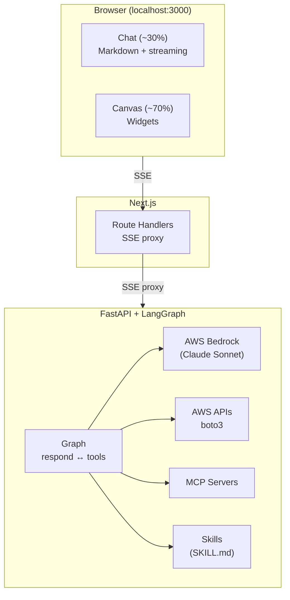

# AgentHub Starter — Documentation

Welcome. This folder contains everything you need to understand, run,
and extend the AgentHub Starter.

## Reading order (recommended)

Each doc links to the next at the bottom — follow them in order if
you're new:

| # | Doc | What you'll learn |
|---|-----|-------------------|
| 1 | [Getting Started](./getting-started.md) | Prerequisites, install, first run |
| 2 | [Architecture](./architecture.md) | High-level design, data flow, conventions |
| 3 | [Backend](./backend.md) | FastAPI + LangGraph internals |
| 4 | [Frontend](./frontend.md) | Next.js + React, chat/canvas UI |
| 5 | [Widgets](./widgets.md) | Canvas widget system + adding new ones |
| 6 | [Tools](./tools.md) | How the LLM calls AWS, widgets, MCP, skills |
| 7 | [MCP Servers](./mcp-servers.md) | Adding stdio and HTTP MCP servers |
| 8 | [Skills](./skills.md) | Anthropic-style skills (SKILL.md files) |
| 9 | [Configuration](./configuration.md) | Environment variables, config files |
| 10 | [Development](./development.md) | Workflow, lint, typecheck, debugging |
| 11 | [Deployment](./deployment.md) | Docker setup, what's missing for production |
| 12 | [Troubleshooting](./troubleshooting.md) | Common issues and fixes |

## TL;DR — what is this?

A working starter for building **agentic web applications** using:

- **AG-UI protocol** — streaming protocol designed for agent-driven UIs
- **LangGraph** — stateful agent execution graph with built-in tool orchestration
- **AWS Bedrock** — Claude Sonnet for reasoning, runs in your AWS account
- **Next.js + shadcn/ui** — chat-plus-canvas frontend
- **MCP** — connects the agent to external tool servers (AWS Docs, GitHub, …)
- **Skills** — packaged runbooks the agent loads on demand

The reference use case is a **cloud operations assistant**: the user
asks questions in natural language, the agent fetches AWS data and
renders it as live widgets in a side canvas (charts, tables, log
tails, summary cards).

## High-level architecture

For full diagrams of the request flow, state graph, and tool merging,
see [architecture.md](./architecture.md).

---

[Next: Getting Started →](./getting-started.md)
