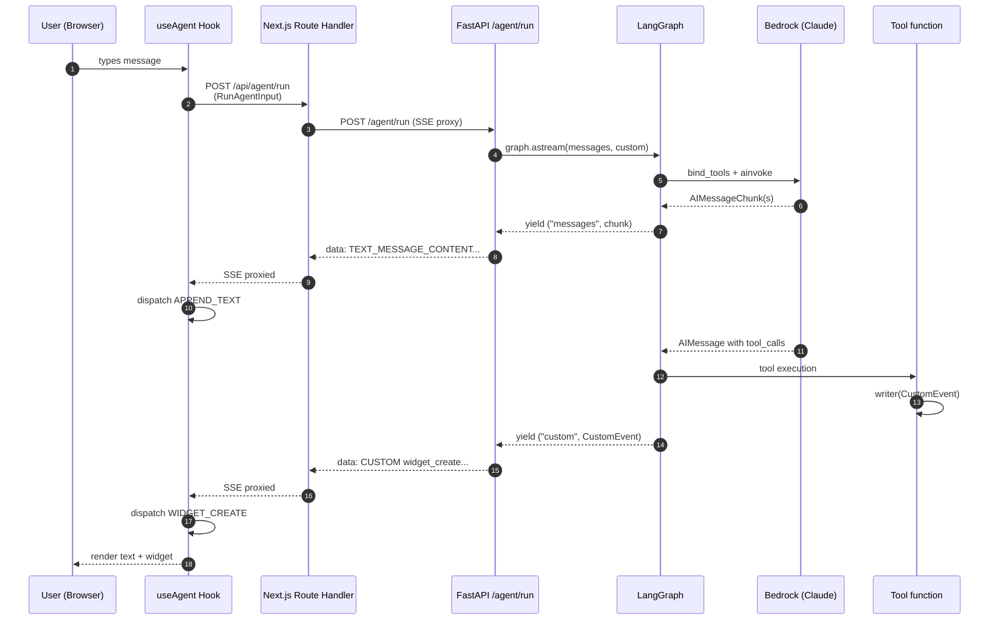
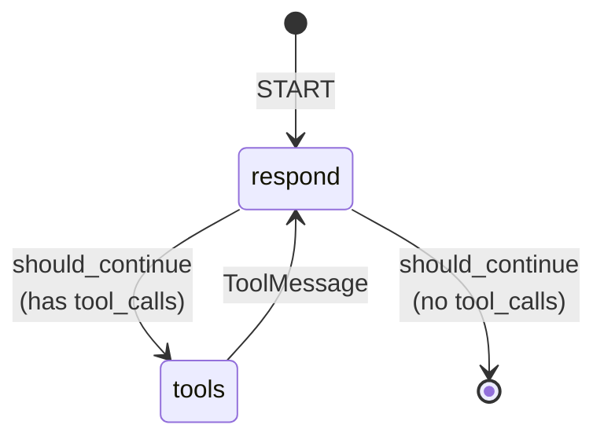

# Architecture

## High-level

This is a single-repo project with a Next.js frontend at the root and a
Python (FastAPI + LangGraph) agent in `agent/`. They communicate over
**Server-Sent Events (SSE)** using the **AG-UI protocol**.

```
agui-starter/
├── app/                    # Next.js App Router (pages, API routes)
├── components/ui/          # shadcn/ui components
├── lib/                    # React hooks, types, reducers
├── agent/                  # Python FastAPI + LangGraph
│   ├── agent/              # Python package (graph, tools, skills loader)
│   ├── skills/             # SKILL.md files
│   └── mcp_*.py            # MCP server demos
├── docs/                   # this folder
└── docker-compose.yml      # 3 services: web, agent, mcp-http
```

## Request flow — single message



Step by step:

1. **User types** in the chat composer
2. **`useAgent` hook** in [`lib/use-agent.ts`](../lib/use-agent.ts) builds an AG-UI `RunAgentInput` payload and POSTs to `/api/agent/run`
3. **Next.js Route Handler** ([`app/api/agent/run/route.ts`](../app/api/agent/run/route.ts)) is a thin reverse proxy — it forwards the POST to FastAPI and pipes the SSE response back
4. **FastAPI endpoint** ([`agent/agent/main.py`](../agent/agent/main.py)) calls `graph.astream(stream_mode=["messages", "custom"])`:
   - LLM token chunks (`messages` mode) → `TEXT_MESSAGE_CONTENT` events
   - Custom events from tools (`custom` mode) → passed through
5. **LangGraph** runs the `respond → tools → respond` loop (see state diagram below)
6. **Back in the browser**, `@ag-ui/client`'s `HttpAgent` parses the SSE stream and dispatches callbacks
7. **`agentReducer`** in [`lib/agent-reducer.ts`](../lib/agent-reducer.ts) handles each action and updates state

## LangGraph state graph



- **`respond`** calls Claude with all tools bound
- **`should_continue`** routes based on whether the AIMessage has `tool_calls`
- **`tools`** is a `ToolNode` wrapped in a callable so it sees the runtime
  (native + MCP) tool list

See [backend.md](./backend.md) for implementation, [tools.md](./tools.md)
for the tool categories.

## Stream modes

LangGraph's `astream` supports several modes. We use two:

| Mode | What it yields | Used for |
|------|---------------|----------|
| `messages` | `(AIMessageChunk, metadata)` per token | LLM text streaming |
| `custom` | Whatever was passed to `stream_writer()` | Widget events from tools |

When you pass a list, you get `(mode, event)` tuples. See
`agent/agent/main.py::stream_agent_response`.

## AG-UI events used

The agent emits these AG-UI event types over SSE:

| Event | When |
|-------|------|
| `RUN_STARTED` | First event of every run |
| `TEXT_MESSAGE_START` | Before the first token of an assistant message |
| `TEXT_MESSAGE_CONTENT` | Each LLM token chunk (`delta`) |
| `TEXT_MESSAGE_END` | After the last token |
| `CUSTOM` | Widget create/update/remove events from tools |
| `RUN_FINISHED` | Last event of every run |

Encoding is plain SSE: `data: <json>\n\n` per event. We use
`event.model_dump_json(by_alias=True, exclude_none=True)` to serialize.

## Custom widget events

Three custom event names sit on top of `CUSTOM`:

| name | value shape |
|------|------------|
| `widget_create` | full widget object (see [widgets.md](./widgets.md)) |
| `widget_update` | `{widget_id, patch: <RFC 6902 JSON Patch>}` |
| `widget_remove` | `{widget_id}` |

## Tool registry

Tools come from four places, all merged at request time:

```
NATIVE_TOOLS (compiled into the binary)
├── WIDGET_TOOLS    — create_summary_card, create_timeseries_chart, …
├── AWS_TOOLS       — list_lambda_functions, list_log_groups, …
└── SKILLS_TOOLS    — invoke_skill

_mcp_tools (loaded async at startup from mcp_servers.json)
└── e.g. aws_docs_search_documentation, remote_server_info, github_*
```

See [tools.md](./tools.md) for the full breakdown.

## Checkpointing

LangGraph uses `InMemorySaver` (the in-memory checkpointer) keyed by
`thread_id`. This means:

- Conversations within a single agent process keep history
- Restarting the agent loses everything
- HITL `interrupt()` patterns work, but only within a process lifetime

Phase 7 of `PLAN.md` swaps this for `PostgresSaver` — it's a ~30-line
change because LangGraph's checkpointer interface is uniform.

## Key conventions

- **Widget schemas live in `agent/agent/widgets.py`** (Pydantic).
  TypeScript types in `lib/widgets.ts` mirror them by hand.
- **Widget IDs are ULIDs** generated by the agent.
- **Widget updates use JSON Patch (RFC 6902)** via `jsonpatch` (Python)
  and `fast-json-patch` (TypeScript).
- **The LLM never formats AG-UI JSON directly.** It calls tools, which
  emit `CustomEvent` objects via the LangGraph `StreamWriter`.
- **AWS auth uses boto3's default chain.** `~/.aws/credentials` is
  mounted into the agent container read-only.

## Why these choices?

- **AG-UI** gives us a streaming protocol designed for agent UIs (text
  chunks, tool calls, custom widget events) without inventing our own.
- **LangGraph** gives durable, debuggable agent execution with built-in
  tool orchestration, streaming, and checkpoints.
- **Bedrock** keeps the LLM in your AWS account (data + cost control).
- **shadcn/ui** components are owned, not imported — easy to customize.
- **Skills + MCP** keep the agent's capabilities composable and
  user-extendable.

---

[← Back to docs index](./README.md) · [← Previous: Getting Started](./getting-started.md) · [Next: Backend →](./backend.md)
