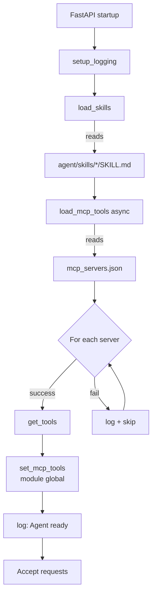
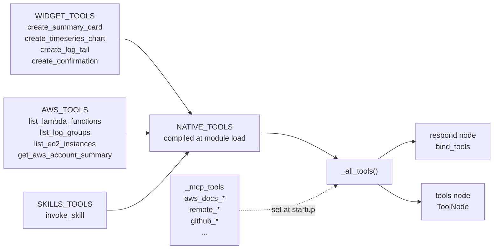

# Backend

The Python agent in `agent/`.

## Stack

- **Python 3.12** (managed via `uv`)
- **FastAPI** — HTTP + SSE
- **LangGraph 1.x** — stateful agent execution
- **langchain-aws** — `ChatBedrockConverse` for AWS Bedrock
- **ag-ui-protocol** — official AG-UI Python SDK (event types, encoder)
- **structlog** — structured logging
- **boto3** — AWS API calls
- **langchain-mcp-adapters** — MCP client wrapper

## File map

```
agent/
├── pyproject.toml              # uv-managed deps + ruff/mypy config
├── uv.lock                     # locked deps
├── Dockerfile                  # container image
├── mcp_servers.json            # MCP config (gitignored)
├── mcp_servers.json.example    # documented example
├── mcp_demo_server.py          # tiny stdio MCP demo
├── mcp_http_server.py          # HTTP MCP demo (port 8765)
├── skills/                     # SKILL.md folders
└── agent/                      # the actual python package
    ├── main.py                 # FastAPI app, SSE streaming
    ├── graph.py                # LangGraph state graph
    ├── bedrock.py              # ChatBedrockConverse client
    ├── widgets.py              # Pydantic widget schemas (source of truth)
    ├── events.py               # AG-UI event builders
    ├── mcp_client.py           # MCP loader
    ├── skills_loader.py        # Skills loader
    ├── logging_config.py       # structlog setup
    └── tools/
        ├── widget_tools.py     # create_summary_card, …
        ├── aws_tools.py        # list_lambda_functions, …
        └── skills_tools.py     # invoke_skill
```

## Entry point — `agent/agent/main.py`

The FastAPI app exposes:

| Route | Method | Purpose |
|-------|--------|---------|
| `/agent/run` | POST | AG-UI streaming endpoint (the main one) |
| `/health` | GET | Liveness check |

### Lifespan

`main.py` uses a FastAPI `lifespan` context manager that runs once at startup:



```python
@asynccontextmanager
async def lifespan(_app: FastAPI):
    skills = load_skills()
    mcp_tools = await load_mcp_tools()
    set_mcp_tools(mcp_tools)
    yield
```

Skills are discovered from `agent/skills/` (see [skills.md](./skills.md)).
MCP tools are loaded from `mcp_servers.json` (see
[mcp-servers.md](./mcp-servers.md)). Both are made available to the
graph via globals.

### Streaming

`stream_agent_response()` wraps `graph.astream()` and converts
LangGraph events to AG-UI events:

```python
async for mode, event in graph.astream(input, config, stream_mode=["messages", "custom"]):
    if mode == "messages":
        chunk, metadata = event
        # convert AIMessageChunk → TextMessageContentEvent
    elif mode == "custom":
        # CustomEvent from tools — pass through
        yield _sse(event)
```

Note: Bedrock returns content as a list of typed blocks
(`[{"type": "text", "text": "..."}]`), not a plain string. The
`_extract_text_delta()` helper handles both shapes.

## Graph — `agent/agent/graph.py`

Simple two-node loop:

```
START → respond → (has tool_calls?) → tools → respond → END
                       └ no tool calls? ──────────────────┘
```

- **`respond`** calls Claude with tools bound, returns the AIMessage
- **`tools`** is a `ToolNode` wrapped in a callable so it sees the
  current (native + MCP) tool list at request time
- **`should_continue`** routes based on whether the last message has
  tool calls

The system prompt is composed at request time:

```python
prompt = SYSTEM_PROMPT + skills_summary()
```

where `skills_summary()` returns a markdown bullet list of available
skills (name + description). This makes newly-added skills visible
without a restart.

## Tool registry

Tools are merged from four sources at request time:



```python
NATIVE_TOOLS = [*WIDGET_TOOLS, *AWS_TOOLS, *SKILLS_TOOLS]
_mcp_tools: list[BaseTool] = []  # filled at startup

def _all_tools():
    return [*NATIVE_TOOLS, *_mcp_tools]
```

`_all_tools()` is called inside both `respond` (for `bind_tools`) and
`call_tools` (for `ToolNode`). This avoids stale references when MCP
tools load asynchronously.

## Bedrock client

`agent/agent/bedrock.py` is one function:

```python
def get_chat_model() -> ChatBedrockConverse:
    return ChatBedrockConverse(
        model=os.environ.get("BEDROCK_AGENT_MODEL", "us.anthropic.claude-sonnet-4-5-..."),
        region_name=os.environ.get("AWS_REGION", "us-east-1"),
    )
```

Uses **cross-region inference profiles** (the `us.` prefix). boto3
under the hood reads credentials from the default chain.

## Widget schemas

`agent/agent/widgets.py` is the **source of truth** for widget types.
Pydantic models with `Literal` discriminators on the `type` field. Six
widget types: `summary_card`, `results_table`, `timeseries_chart`,
`log_tail`, `confirmation`, `query_plan`.

TypeScript mirrors live in `lib/widgets.ts`. **If you change the
Pydantic schemas, update the TS types in the same commit.**

## Tools — three categories

All under `agent/agent/tools/`:

1. **Widget tools** (`widget_tools.py`) — emit `widget_create` events
   to render UI: `create_summary_card`, `create_timeseries_chart`,
   `create_log_tail`, `create_confirmation`.

2. **AWS tools** (`aws_tools.py`) — make boto3 calls and emit a
   `results_table` widget showing the data:
   `list_lambda_functions`, `list_log_groups`, `list_ec2_instances`,
   `get_aws_account_summary`. Errors gracefully render in the widget
   via `widget_update` JSON Patches.

3. **Skills tools** (`skills_tools.py`) — `invoke_skill(name)` loads
   a SKILL.md body into context.

See [tools.md](./tools.md) for full reference.

## MCP integration

`agent/agent/mcp_client.py` reads `mcp_servers.json` at startup. Each
server is loaded independently — one bad server doesn't block others.
Supports stdio and `streamable_http` transports. Env var substitution
(`${VAR}`) is applied before passing to `MultiServerMCPClient`.

See [mcp-servers.md](./mcp-servers.md) for adding servers.

## Skills

`agent/agent/skills_loader.py` discovers `agent/skills/<name>/SKILL.md`
files, parses YAML frontmatter, and exposes `list_skills()`,
`get_skill()`, and `skills_summary()`. The agent advertises skills in
the system prompt, then loads full content via the `invoke_skill` tool
when relevant.

See [skills.md](./skills.md) for writing new skills.

## Logging

`agent/agent/logging_config.py` configures `structlog`:

- Colored console output in dev (TTY)
- JSON output in production (set `json_output=True`)

Every log call is structured:

```python
logger.info("Starting agent run", thread_id=thread_id, run_id=run_id, ...)
```

## Type checking

mypy strict mode (`pyproject.toml`). A few `type: ignore` comments
exist for inconsistencies in the LangGraph and boto3 stubs.

```bash
cd agent && uv run mypy agent/
```

---

[← Back to docs index](./README.md) · [← Previous: Architecture](./architecture.md) · [Next: Frontend →](./frontend.md)
