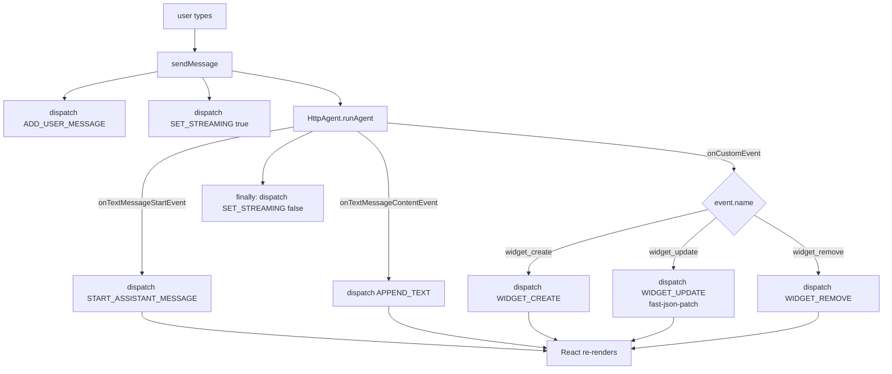

# Frontend

The Next.js app at the repo root.

## Stack

- **Next.js 15** with App Router
- **React 19** + **TypeScript** (strict)
- **Tailwind CSS v4** with `@tailwindcss/typography`
- **shadcn/ui** (New York style, Slate base) — components owned in `components/ui/`
- **`@ag-ui/client`** — typed SSE consumer
- **react-markdown** + **remark-gfm** + **rehype-highlight** — chat rendering
- **recharts** — chart widgets
- **fast-json-patch** — widget JSON Patch application

## File map

```
app/
├── layout.tsx                       # root layout, fonts, globals.css
├── page.tsx                         # redirects to /chat
├── globals.css                      # tailwind + shadcn theme
├── api/agent/run/route.ts           # SSE proxy to FastAPI
└── (app)/                           # route group with shared layout
    ├── layout.tsx                   # header with nav (Chat, Health)
    ├── chat/
    │   ├── page.tsx                 # Server Component shell
    │   └── _components/
    │       ├── chat-surface.tsx     # 2-column resizable layout
    │       ├── canvas.tsx           # right pane (widget stack)
    │       ├── composer.tsx         # textarea + send button
    │       ├── message-list.tsx     # scrolling message list
    │       ├── message-bubble.tsx   # user/assistant bubble (markdown)
    │       ├── widget-registry.tsx  # widget type → component map
    │       ├── widget-error-boundary.tsx
    │       └── widgets/             # one component per widget type
    └── admin/health/page.tsx        # frontend + agent health check

components/
├── ui/                              # shadcn components (button, card, …)
└── (no app-level components yet)

lib/
├── use-agent.ts                     # main hook — SSE consumer + reducer dispatch
├── agent-reducer.ts                 # state reducer (text + widget events)
├── widgets.ts                       # TS widget types (mirror of Pydantic)
├── types.ts                         # ChatMessage type
└── utils.ts                         # cn() helper

middleware.ts                        # (placeholder for future JWT verify)
```

## Layout

A Tailwind `flex h-dvh flex-col` shell with:

- **Header** (`app/(app)/layout.tsx`) — 12px tall, brand + nav links
- **Main** — fills the rest, contains the chat page
- **Chat page** (`chat-surface.tsx`) — `<ResizablePanelGroup>`:
  - Left: `MessageList` + `Composer` (default 30%)
  - Right: `Canvas` with stacked widgets (default 70%)

## State management

A single `useReducer` in `useAgent`. State shape:

```ts
interface AgentState {
  messages: ChatMessage[];     // user + assistant text
  widgets: Widget[];           // canvas widgets
  isStreaming: boolean;        // disables composer during runs
}
```

Actions handled by `agentReducer`:

| Action | Effect |
|--------|--------|
| `ADD_USER_MESSAGE` | Appends user message |
| `START_ASSISTANT_MESSAGE` | Appends empty assistant message |
| `APPEND_TEXT` | Appends `delta` to assistant message by id |
| `SET_STREAMING` | Toggles streaming flag |
| `SET_ERROR` | Replaces a message with an error string |
| `WIDGET_CREATE` | Pushes a widget |
| `WIDGET_UPDATE` | Applies JSON Patch via `fast-json-patch` |
| `WIDGET_REMOVE` | Filters out by id |

## SSE consumption



`useAgent` constructs an `HttpAgent` from `@ag-ui/client`:

```ts
const agent = new HttpAgent({
  url: "/api/agent/run",
  threadId: crypto.randomUUID(),
  initialMessages: [],
});
agent.setMessages(agMessages);
await agent.runAgent({}, {
  onTextMessageStartEvent: ({ event }) => dispatch(...),
  onTextMessageContentEvent: ({ event }) => dispatch(...),
  onCustomEvent: ({ event }) => {
    if (event.name === "widget_create") dispatch({ type: "WIDGET_CREATE", ... });
    // etc
  },
});
```

The `HttpAgent` handles SSE parsing, reconnects, and error propagation
internally.

## Widget rendering

`widget-registry.tsx` is a switch on `widget.type`:

```tsx
switch (widget.type) {
  case "summary_card": return <SummaryCardWidget widget={widget} />;
  case "results_table": return <ResultsTableWidget widget={widget} />;
  case "timeseries_chart": return <TimeseriesChartWidget widget={widget} />;
  case "log_tail": return <LogTailWidget widget={widget} />;
  case "confirmation": return <ConfirmationWidget widget={widget} />;
  case "query_plan": return <Placeholder />;
}
```

Each widget is wrapped in a `WidgetErrorBoundary` so a single render
failure doesn't crash the canvas.

## Markdown rendering

`message-bubble.tsx` uses `react-markdown` for assistant messages with:

- **`remark-gfm`** — tables, strikethrough, task lists, autolinks
- **`rehype-highlight`** — syntax highlighting via `highlight.js`
  (theme: `github-dark`, imported in `globals.css`)
- **Tailwind `prose` classes** — base typography
- **Custom `prose-code` / `prose-pre` overrides** — guaranteed
  high-contrast code in both bubble colors

User messages render as plain text with `whitespace-pre-wrap`.

## Why a Route Handler proxy?

`app/api/agent/run/route.ts` is a thin reverse proxy. Two reasons:

1. **CORS** — the browser only ever talks to `/api/agent/run`; the
   FastAPI agent isn't exposed cross-origin
2. **Future auth** — Phase 5 will add JWT verification at this layer
   without touching the agent

The proxy just pipes the SSE response body straight back:

```ts
const agentResponse = await fetch(`${AGENT_URL}/agent/run`, {...});
return new Response(agentResponse.body, {
  headers: { "Content-Type": "text/event-stream", ... },
});
```

## Adding a widget type

See [widgets.md](./widgets.md). Short version:

1. Add the Pydantic model in `agent/agent/widgets.py`
2. Mirror the type in `lib/widgets.ts`
3. Build the React component in `app/(app)/chat/_components/widgets/`
4. Add a `case` in `widget-registry.tsx`
5. Add a creation tool in `agent/agent/tools/widget_tools.py`

## Lint + typecheck

```bash
npm run lint        # eslint with next/core-web-vitals + next/typescript
npm run typecheck   # tsc --noEmit
```

Both must pass before commit. CI runs them on PRs.

---

[← Back to docs index](./README.md) · [← Previous: Backend](./backend.md) · [Next: Widgets →](./widgets.md)
