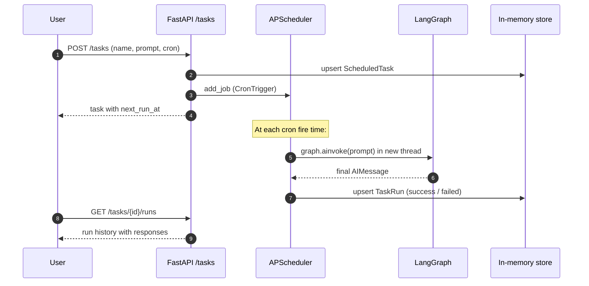

# Scheduled Tasks

Run prompts on a recurring schedule. Each scheduled execution runs
the LangGraph agent in a fresh thread and stores the final response
in a run history. Inspired by Claude Cowork / Claude Code's
scheduled-task feature.

## How it works



- **Time zone**: cron expressions are interpreted in `America/New_York`
  (EST/EDT, DST handled automatically)
- **Storage**: in-memory dict — like the LangGraph `InMemorySaver`,
  restarting the agent loses all tasks
- **Concurrency**: APScheduler's `AsyncIOScheduler` runs jobs on the
  same event loop as FastAPI; `coalesce=True` so missed fires (e.g.
  during downtime) don't pile up
- **Isolation**: each run uses `thread_id = task-{task_id}-{run_id}`,
  so scheduled tasks don't share conversation state with the chat or
  with each other

## REST API

| Method | Path | Purpose |
|--------|------|---------|
| `GET` | `/tasks/presets` | Friendly cron presets for the create form |
| `GET` | `/tasks` | List all tasks with computed `next_run_at` |
| `POST` | `/tasks` | Create a task |
| `GET` | `/tasks/{id}` | Get task detail |
| `PATCH` | `/tasks/{id}` | Update name / prompt / cron / enabled |
| `DELETE` | `/tasks/{id}` | Delete task + run history |
| `POST` | `/tasks/{id}/run` | Manually trigger a task |
| `GET` | `/tasks/{id}/runs` | List run history (newest first) |

The Next.js frontend proxies all of these via
`app/api/tasks/[[...path]]/route.ts`.

## Schedule presets

The `/tasks/presets` endpoint returns these built-in options:

| Label | Cron |
|-------|------|
| Every 5 minutes | `*/5 * * * *` |
| Every 15 minutes | `*/15 * * * *` |
| Every hour | `0 * * * *` |
| Every 6 hours | `0 */6 * * *` |
| Daily at 9am EST | `0 9 * * *` |
| Weekdays at 9am EST | `0 9 * * 1-5` |
| Weekly Monday 9am EST | `0 9 * * 1` |

Users can also supply a custom cron expression via the "Custom cron…"
option in the dropdown.

## Data models

`agent/agent/tasks/models.py`:

```python
class ScheduledTask(BaseModel):
    id: str                  # ULID
    name: str
    prompt: str
    cron: str                # 5-field cron
    timezone: str            # default "America/New_York"
    enabled: bool
    created_at: str          # ISO 8601 UTC
    last_run_at: str | None
    last_run_status: Literal["success", "failed"] | None
    last_run_id: str | None

class TaskRun(BaseModel):
    id: str                  # ULID
    task_id: str
    started_at: str
    completed_at: str | None
    status: Literal["running", "success", "failed"]
    response: str | None     # final assistant text
    error: str | None
    trigger: Literal["scheduled", "manual"]
```

The list endpoint decorates each task with `next_run_at` computed
from the cron expression at request time.

## File map

```
agent/agent/tasks/
├── __init__.py
├── models.py        # Pydantic models + presets + request bodies
├── store.py         # in-memory dict for tasks + runs
└── runner.py        # APScheduler + execute_task()

app/(app)/tasks/
├── page.tsx         # list + create dialog
└── [id]/page.tsx    # detail + run history

app/api/tasks/
└── [[...path]]/route.ts   # catch-all proxy to agent
```

## Frontend UI

- **`/tasks`** — table of all tasks with name, schedule (cron string),
  last-run status badge, next-run time (in EST), Run Now / Delete
  actions. "New task" opens a dialog with name, prompt textarea, and
  schedule dropdown (preset or custom cron).
- **`/tasks/{id}`** — task header with prompt + next-run time, plus a
  collapsible run history. Each run shows status, trigger
  (`scheduled` / `manual`), timestamp, and the full response rendered
  with markdown + syntax highlighting (same renderer as the chat).

All times displayed in `America/New_York` regardless of the user's
locale, to match the cron interpretation.

## Common operations

### Create a task

```bash
curl -X POST http://localhost:3000/api/tasks \
  -H "Content-Type: application/json" \
  -d '{
    "name": "Hourly account check",
    "prompt": "What is my AWS account info? Be brief.",
    "cron": "0 * * * *"
  }'
```

### Trigger a task immediately

```bash
curl -X POST http://localhost:3000/api/tasks/<task-id>/run
```

Returns the `TaskRun` synchronously (the request blocks until the
agent finishes). Useful for testing without waiting for the next
cron fire.

### See past runs

```bash
curl http://localhost:3000/api/tasks/<task-id>/runs
```

## Future work

- **Persistence (Phase 7)**: when the LangGraph checkpointer moves to
  Postgres, swap `agent/tasks/store.py` for a Postgres-backed store
  and switch APScheduler to `SQLAlchemyJobStore`. Tasks survive
  restarts and can be shared across worker processes.
- **Notifications**: surface a badge in the chat header / send email
  / webhook when a scheduled run completes (deferred).
- **Per-tenant scoping**: when Phase 5 adds tenant scoping to the
  chat, scheduled tasks should be tenant-scoped too.
- **Task editing in the UI**: PATCH endpoint exists; UI for it
  (deferred).

---

[← Back to docs index](./README.md) · [← Previous: Skills](./skills.md) · [Next: Configuration →](./configuration.md)
