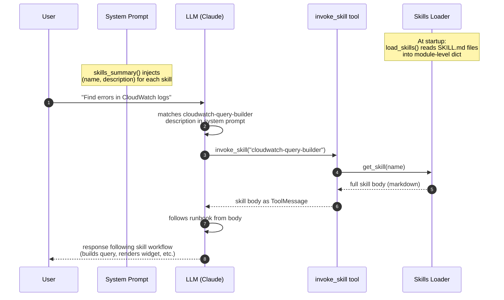

# Skills

Skills are **packaged runbooks the agent loads on demand**. Each skill
is a markdown file with YAML frontmatter that lives in `agent/skills/`.
The agent advertises available skills in its system prompt (just name +
description), then calls the `invoke_skill` tool to pull a skill's full
body into context when relevant.

This is Anthropic's "Skills" pattern — see Claude Code's skill system
for a similar implementation.

## Why skills?

- **Lazy loading** — Don't bloat the system prompt with every runbook.
  Only load when the user query matches.
- **Composable** — Each skill is a folder; can include scripts,
  references, or examples alongside the SKILL.md.
- **Authorable** — Anyone on the team can write a skill in markdown
  without touching Python.
- **Domain-specific** — Skills can encode org knowledge that an LLM
  wouldn't know from training.

## Format

`agent/skills/<skill-name>/SKILL.md`:

```markdown
---
name: skill-name
description: One-sentence trigger description. The agent's system prompt shows this; the LLM uses it to decide when to invoke the skill.
---

# Body content

Markdown instructions, examples, runbooks the agent should follow when
this skill is invoked. The full body is loaded into the LLM's context
via the `invoke_skill` tool.

## Workflow

1. Step 1
2. Step 2

## Patterns

```code
example code goes here
```
```

### Frontmatter requirements

| Field | Required | Notes |
|-------|----------|-------|
| `name` | yes | Must match the directory name (recommended), unique |
| `description` | yes | One sentence; trigger text the LLM matches against |

## Loading

`agent/agent/skills_loader.py::load_skills()`:

1. Scans `agent/skills/*/SKILL.md`
2. Parses YAML frontmatter (split on `---`)
3. Validates `name` and `description` are present
4. Stores by name in a module-level dict
5. Logs `Loaded skills count=N names=[...]`

Called once at startup from FastAPI's lifespan. To pick up new skills,
restart the agent.

## How the agent uses skills



The system prompt is composed at request time:

```python
prompt = SYSTEM_PROMPT + skills_summary()
```

`skills_summary()` returns:

```markdown

## Available Skills

- **aws-cost-analysis** — Help analyze AWS spend, identify cost drivers...
- **cloudwatch-query-builder** — Translate natural-language requests into...
- **incident-response** — Step-by-step runbook for triaging...

Call the `invoke_skill` tool with the skill name to load full instructions...
```

When the user's query matches a skill description, the LLM:

1. Calls `invoke_skill(name="cloudwatch-query-builder")`
2. Gets the full body of the skill back
3. Follows the instructions for the rest of the response

## Shipped skills

### `cloudwatch-query-builder`

Translates natural-language log queries into Logs Insights syntax.
Includes patterns for errors, status code aggregation, latency
percentiles, Lambda cold starts, etc. Walks the agent through the
right workflow (identify log groups → time range → query → render).

Triggers: "find errors", "query CloudWatch", "show me logs", etc.

### `aws-cost-analysis`

Guides cost-related questions: identifying drivers, suggesting
savings, choosing the right time window. Notes that Cost Explorer
tools aren't included in the starter — the skill recommends pointing
the user to the AWS Console.

Triggers: "AWS bill", "cost analysis", "save money on AWS", etc.

### `incident-response`

Triage runbook for production issues. Priority order: stop the
bleeding → communicate → diagnose. Includes templates for status
updates, links between skills (uses `cloudwatch-query-builder` for
log queries during diagnosis).

Triggers: "outage", "page", "production is down", etc.

## Writing a new skill

### 1. Create the directory

```bash
mkdir -p agent/skills/my-new-skill
```

### 2. Write the SKILL.md

```markdown
---
name: my-new-skill
description: One sentence describing when the agent should use this skill.
---

# My New Skill

When the user matches this skill, follow the steps below.

## Workflow

1. ...
2. ...

## Patterns

(Examples, code, references.)
```

### 3. Restart the agent

Skills are loaded once at startup. Restart and check the logs:

```
Loaded skills count=4 names=['aws-cost-analysis', 'cloudwatch-query-builder', 'incident-response', 'my-new-skill']
```

The new skill will appear in the system prompt automatically.

## Best practices

- **Keep `description` concise and trigger-focused.** The LLM matches
  on this. "Help with X" is better than a paragraph.
- **The body should be a runbook**, not background information. Tell
  the agent exactly what to do.
- **Reference other tools in the skill body.** "Use `list_log_groups`
  to discover available log groups" works because the LLM has those
  tools bound.
- **Put examples in code blocks.** They render cleanly when loaded
  into the LLM's context.
- **Skills can chain.** The `incident-response` skill references
  `cloudwatch-query-builder`. The agent follows the chain.

## Skill anatomy of `cloudwatch-query-builder`

Take a look at `agent/skills/cloudwatch-query-builder/SKILL.md` for a
full real example. Sections:

1. **Purpose** — when to use this skill (1-2 sentences)
2. **Workflow** — numbered steps the agent follows
3. **Query patterns** — code blocks with concrete examples
4. **Style rules** — don'ts and conventions
5. **Time range guidance** — table of common phrasings → ranges
6. **When NOT to use this skill** — boundaries

## How this differs from MCP

| Aspect | MCP | Skills |
|--------|-----|--------|
| Format | Code (server implementation) | Markdown |
| Capability | Adds new tools the LLM can call | Adds knowledge the LLM should follow |
| Authoring | Engineering | Anyone who can write markdown |
| Loading | At startup | At startup, but content is lazy-loaded per call |
| Use case | "Search GitHub" | "Here's our incident response runbook" |

You can — and probably should — use both. MCP gives the agent new
capabilities; skills give it institutional knowledge.

## Implementation notes

- Skills loader: `agent/agent/skills_loader.py`
- Tool: `agent/agent/tools/skills_tools.py`
- System prompt augmentation: `agent/agent/graph.py::respond`
- Lifespan hook: `agent/agent/main.py::lifespan`

---

[← Back to docs index](./README.md) · [← Previous: MCP Servers](./mcp-servers.md) · [Next: Scheduled Tasks →](./scheduled-tasks.md)
